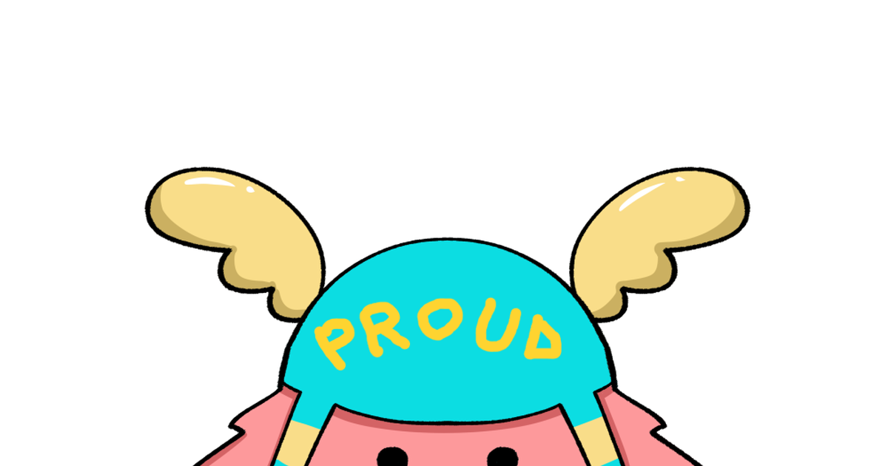

<html lang="ja">
<head>
  <meta charset="UTF-8">
  <title>SARAオプチャ専用　　チーム分け！</title>
  <link href="https://fonts.googleapis.com/css2?family=Kaisei+Decol:wght@700&family=Zen+Maru+Gothic:wght@400;700&display=swap" rel="stylesheet">
  
</head>
<body>
  

    

      
    

    

  
    <h1>SARAオプチャ専用 
      チーム分け！</h1>
    

    <h2>メンバーリスト</h2>
    <ul class="participants" id="participants-list">
      <li><label><input type="checkbox" value="さら">さら</label></li>
      <li><label><input type="checkbox" value="ひろ">ひろ</label></li>
      <li><label><input type="checkbox" value="あきとん">あきとん</label></li>
      <li><label><input type="checkbox" value="みやび">みやび</label></li>
      <li><label><input type="checkbox" value="ぴーなっつ">ぴーなっつ</label></li>
      <li><label><input type="checkbox" value="SK">SK</label></li>
      <li><label><input type="checkbox" value="とうえい">とうえい</label></li>
      <li><label><input type="checkbox" value="しゃけ">しゃけ</label></li>
      <li><label><input type="checkbox" value="じぇいず">じぇいず</label></li>
      <li><label><input type="checkbox" value="ちい">ちい</label></li>
      <li><label><input type="checkbox" value="まっつん">まっつん</label></li>
      <li><label><input type="checkbox" value="まみーご">まみーご</label></li>
      <li><label><input type="checkbox" value="むちょ">むちょ</label></li>
      <li><label><input type="checkbox" value="やま">やま</label></li>
      <li><label><input type="checkbox" value="バナナ">バナナ</label></li>
      <li><label><input type="checkbox" value="ファンタ">ファンタ</label></li>
      <li><label><input type="checkbox" value="ボウ">ボウ</label></li>
      <li><label><input type="checkbox" value="ぺちゃうさ">ぺちゃうさ</label></li>
      <li><label><input type="checkbox" value="ちゃぶ">ちゃぶ</label></li>
      <li><label><input type="checkbox" value="シュガー">シュガー</label></li>
      <li><label><input type="checkbox" value="とん">とん</label></li>
      <li><label><input type="checkbox" value="ぽんずのしゅけ">ぽんずのしゅけ</label></li>
      <li><label><input type="checkbox" value="ちゃま">ちゃま</label></li>
      <li><label><input type="checkbox" value="まの">まの</label></li>
      <li><label><input type="checkbox" value="けん">けん</label></li>
      <li><label><input type="checkbox" value="五条">五条</label></li>
      <li><label><input type="checkbox" value="ぼんど">ぼんど</label></li>
      <li><label><input type="checkbox" value="とき">とき>とき>とｋ>と</li>
      <li><label><input type="checkbox" value="新メンバー用">新メンバー用</label></li>
    </ul>
    

      チーム数:
      <input type="number" id="team-count" min="2" value="2">
    

    

      <button onclick="splitTeams()">チーム分け！</button>
      <button onclick="resetAll()">リセット</button>
    

    

    

  

  
</body>
</html>
